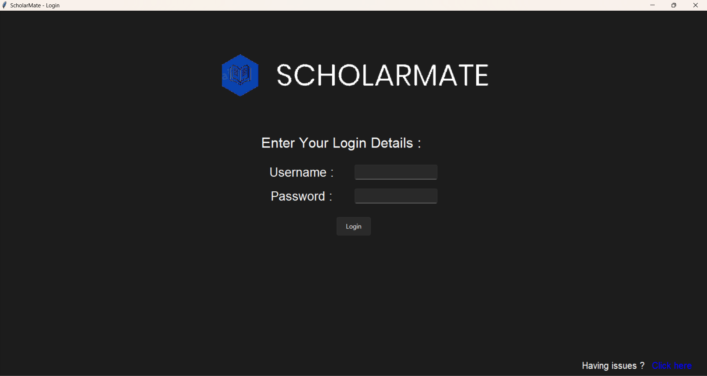
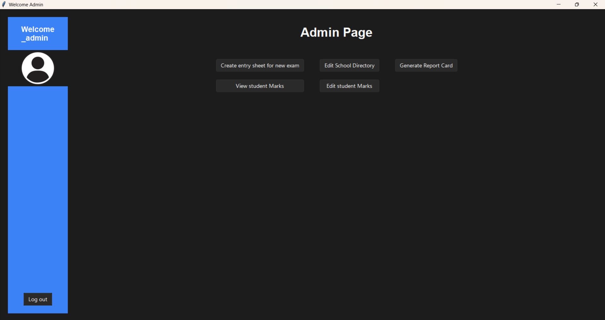

# ScholarMate-RCMS

ScholarMate is an RCMS, being made for CS class 12 project by Anirudh, Dave & Vignesh
The file attatched below describes the design of the software, describing all the features and functionalities included in the software.

https://drive.google.com/file/d/1XUFr5fEAIPeqqcX7lUnfNcna0rNyRoBH/view?usp=sharing

The file attatched bellow describes the MySQL database structure

https://drive.google.com/file/d/1QQCceEJRKtQzwJt2dB5-S4vGCiToQtWy/view?usp=sharing

The software will be distributed as a .exe file among clients

The software is open source and here is the list of all the required imports and downloads for the source code : 

# REQUIRED INSTALLS : 

-> pip install pillow (for inserting image) 
-> pip install sv_ttk (for the theme) 
-> pip install fpdf (pdf generation) 
-> pip install mysql.connector 
-> pip install matplotlib (Graph generation)

# How to use ScholarMate ? 

Open login_page.py and enter your username and password. 
As an admin you are allowed multiple access rights to the database server. You are allowed to create a new examination/a sheet for teachers to enter their student's marks, you are allowed to edit the schools directory by adding/removing teachers/students, you are allowed to generate report cards, view any student's/class' marks in a given exam and allowed to edit any student's marks in any exam. The user icon on the left hand side blue bar allows you to change your username and password. You can conveniently log out as well. 

As a teacher, you are assigned to be the class teacher of a given class. You are allowed a restricted access to the database server. First and foremost, you are only allowed to view/edit your own class' marks. You cannot see or edit any other class' marks. You can generate report cards, but only for the students in your class.

As a student, you can only view your marks and generate your own report card
